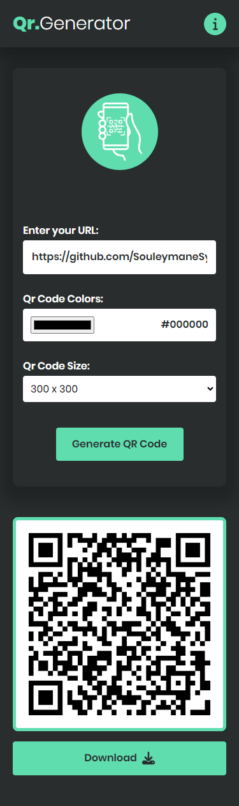
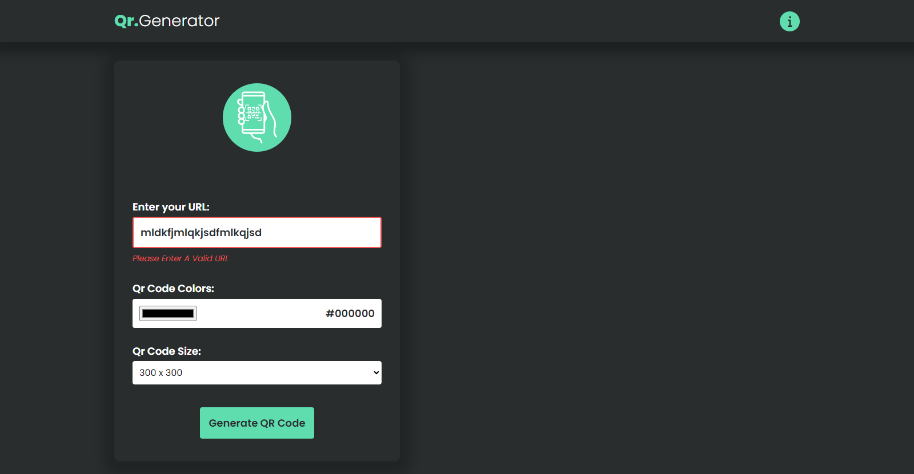

# Welcome 👋

## Qr Code Generator


This project is a simple and efficient QR code generator. It allows you to create custom QR codes for various uses, Whether it's for URLs, Contact information, or any other data.The QR code generator simplifies the process for you.

## Table of contents

- [How To Install](#how-to-install)
- [Features](#features)
- [Screenshot](#screenshot)
- [Built with](#built-with)
- [Links](#links)
- [Author](#author)

## How to install

Install the necessary dependencies by running:

```shell
# Dependencies Installation
Yarn Install
```

Compiles and Hot-reloads for development:

```shell
# For development Server
Yarn dev
```

Compiles and minifies for production:

```shell
# For Production
Yarn build
```

## Features

- Generate QR codes from URL or text data.
- Customize QR code colors and Size.
- Real-time preview of generated QR codes.
- Download the Qr codes as image files (PNG, JPEG).

## Screenshot

here are the screenshots of the projects on multiple devices.

### Mobile



### Tablet


### Desktop


### Modal


### Inputs Errors 1


### Inputs Errors 2



## Built with

- [Yarn](https://yarnpkg.com)
- [Vite](https://vitejs.dev)
- [Vue Js](https://vuejs.org)
- Composition API
- Mobile-first workflow
- SASS
- CSS custom properties
- Flexbox
- CSS Grid

## Links

- Live Site URL: [QR Code Generator - Website](https://qr-code-generator-app-two.vercel.app/)

## Author

This project was developed by Souleymane Sy. You can contact me at [souleymanesyservices@gmail.com](mailto:souleymanesyservices@gmail.com).

Other Socials:

- GitHub - [Souleymane Sy](https://github.com/SouleymaneSy7)
- Frontend Mentor - [@SouleymaneSy7](https://www.frontendmentor.io/profile/SouleymaneSy7)
- Twitter - [@Souleymanesy43](https://twitter.com/Souleymanesy43)
